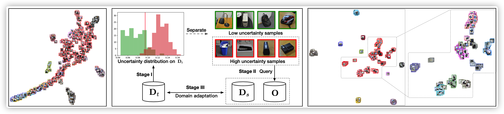
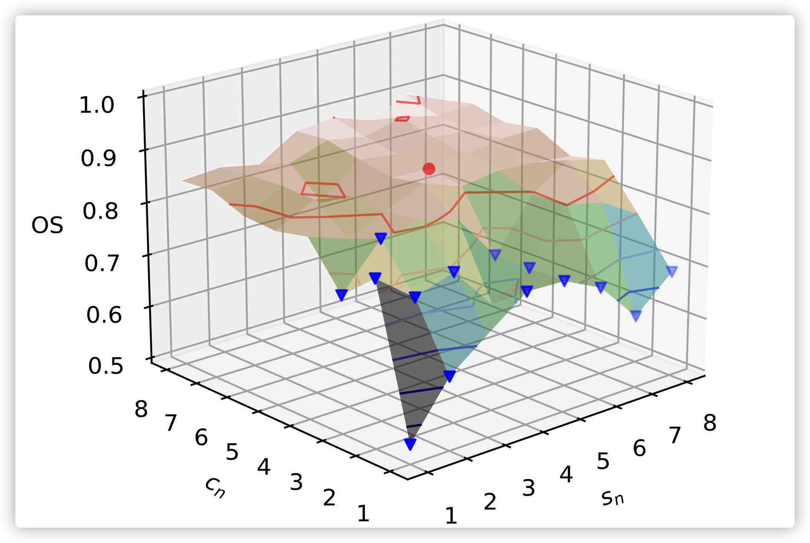

# DATL on PyTorch

[](https://opensource.org/licenses/MIT) 


# Introduction




This is a PyTorch library for DATL. DATL is a new OSDA method. We find that the previous OSDA methods can not solve the problem of unknown sample classification. To solve this problem, we introduce uncertainty detection and active learning into domain adaptation. We find that uncertainty detection can extract unknown samples, and active learning can sample important examples from unknown samples. In short, DATL with active learning might be a more promising direction for OSDA.


## Dataset

First you should download the Office-31 dataset using:
```
!wget https://github.com/syorami/DDC-transfer-learning/raw/master/data/Office31.tar
!mkdir Office31
!tar xf Office31.tar -C Office31
```

## Usage

To run DATL model, use the following commands and arguments
```
python main.py [-source source] [-target target]  [-c_n c_n] [-s_n s_n] [-m_n m_n]
```

| Argument | Description
| :--- | :----------
-source| dslr | webcam | amazon
-target | dslr | webcam | amazon
-c_n | Number of cluster classes
-s_n | Number of samples per unknown cluster
-m_n | Minimum transfer quantity

# Example Results
Here we give the relevant experimental information.

## Grid Search 




## Ablation Analysis

|   Ablation Analysis  |      |      |      |      |      |      |               |
|:--------------------:|------|:----:|:----:|:----:|:----:|:----:|:-------------:|
|                      |  D-W |  D-A |  A-W |  A-D |  W-D |  W-A |      Avg      |
| **DATL**        | 93.8 | 74.8 | 82.1 | 79.9 | 69.8 | 97.6 | **83.0** |
| DATL - No Stage II   | 90.1 | 66.3 | 80.2 | 80.9 | 71.8 | 91.8 |      80.2     |
| DATL - No Stage I/II | 83.1 | 69.4 | 73.8 | 72.9 | 64.6 | 94.2 |      76.3     |

## Comparison with unsupervised
|                  |    D-W    |      |    D-A   |      |    A-W   |      |    A-D   |      |    W-A   |      |  W-D  |      |    AVG   |          |
|------------------|:---------:|:----:|:--------:|:----:|:--------:|:----:|:--------:|:----:|:--------:|:----:|:-----:|:----:|:--------:|:--------:|
|                  |    OS*    |  OS  |    OS*   |  OS  |    OS*   |  OS  |    OS*   |  OS  |    OS*   |  OS  |  OS*  |  OS  |    OS*   |    OS    |
| DANN             |    98.3   | 97.5 |   76.2   | 75.7 |   87.7   | 85.3 |   87.7   | 86.5 |   75.6   | 74.9 | 100.0 | 99.5 |   87.5   |   86.7   |
| OpenMax          |    96.2   | 96.1 |   82.1   | 83.4 |   87.5   | 87.4 |   88.4   | 87.1 |   82.8   | 82.8 |  98.5 | 98.4 |   89.2   |   89.2   |
| ATI-λ    |    95.3   | 93.6 |   79.6   | 78.0 |   88.9   | 87.4 |   86.6   | 84.3 |   81.4   | 80.4 |  98.7 | 96.5 |   88.1   |   87.0   |
|  DATL  (s_n=5) | **100.0** | 96.9 | **87.7** | 85.8 | **98.7** | 85.8 | **98.7** | 80.5 |   89.1   | 85.2 |  100  | 99.7 | **95.2** |   89.5   |
|  DATL  (s_n=7) | **100.0** | 98.4 |   87.3   | 87.3 |   98.3   | 86.8 |   96.1   | 82.7 | **89.4** | 85.5 |  100  | 99.1 |   94.9   | **90.2** |


## Comparison with semi-supervision
|                  |    D-W   |      |  D-A |      |    A-W   |      |    A-D   |      |    W-A   |      |    W-D   |      |    AVG   |      |
|------------------|:---------:|:----:|:--------:|:----:|:--------:|:----:|:--------:|:----:|:--------:|:----:|:-----:|:----:|:--------:|:--------:|
|                  |    OS*   |  OS  |  OS* |  OS  |    OS*   |  OS  |    OS*   |  OS  |    OS*   |  OS  |    OS*   |  OS  |    OS*   |  OS  |
| LSVM             |   87.3   | 88.5 | 68.7 | 71.2 |   72.5   | 74.8 |   82.5   | 84.0 |   66.2   | 69.0 |   93.5   | 94.0 |   78.5   | 80.3 |
| MMD              |   85.5   | 86.7 | 69.0 | 71.3 |   76.4   | 78.3 |   86.1   | 86.8 |   65.1   | 67.8 |   93.9   | 94.4 |   79.3   | 80.9 |
| ATI              |   91.6   | 92.4 | 74.4 | 76.1 |   84.0   | 85.1 |   89.0   | 89.7 |   71.3   | 74.3 |   96.3   | 96.6 |   84.4   | 85.7 |
|  DATL  (s_n=5) | **99.6** | 95.3 | 70.1 | 68.3 |   87.2   | 67.9 | **90.9** | 73.3 |   74.5   | 65.8 | **99.4** | 95.7 | **86.9** | 77.7 |
|  DATL  (s_n=7) |   99.5   | 95.9 | 66.6 | 70.5 | **93.2** | 79.6 | **90.9** | 81.2 | **75.6&nbsp;** | 63.3 | **99.4** | 98.2 | **87.5** | 81.5 |

